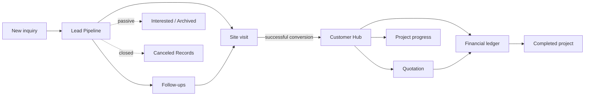
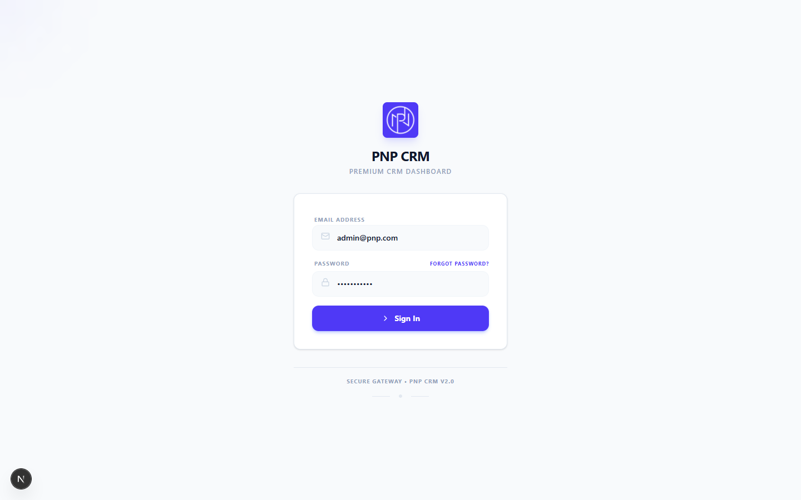
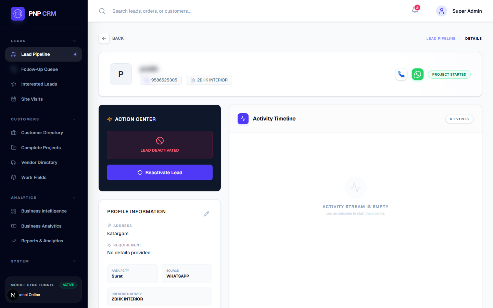
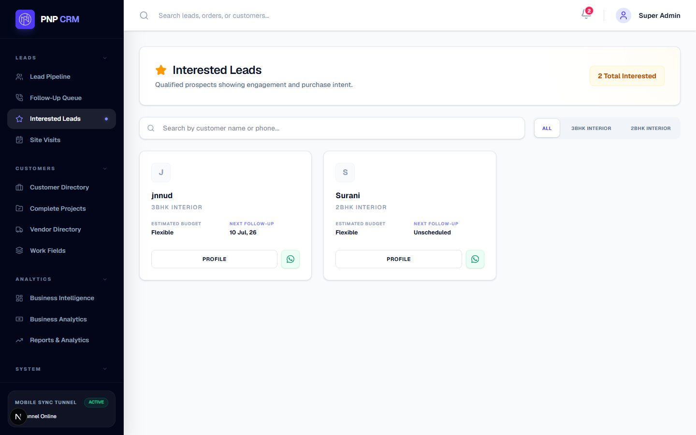
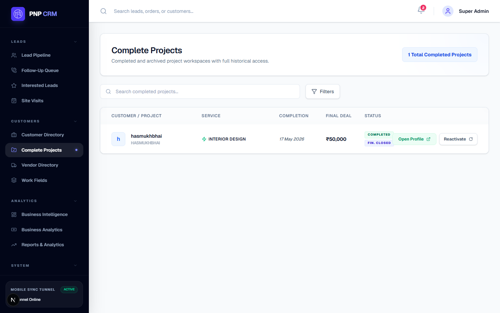
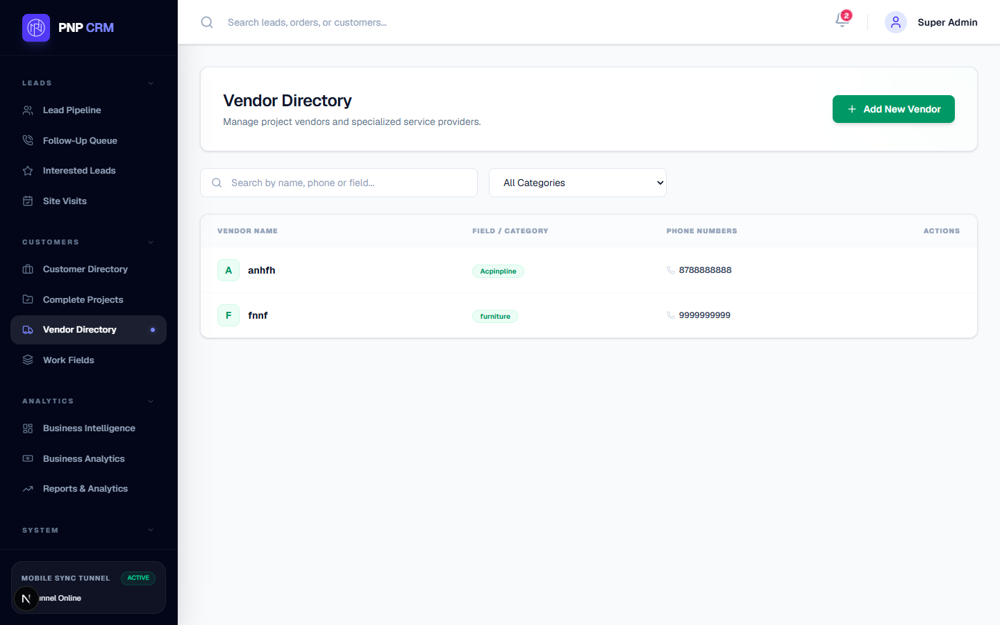
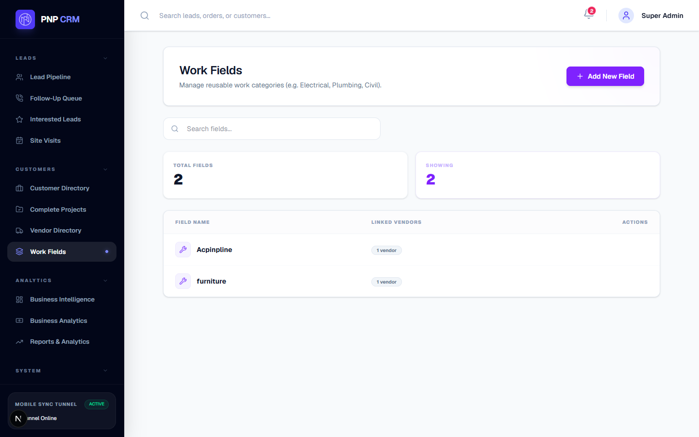
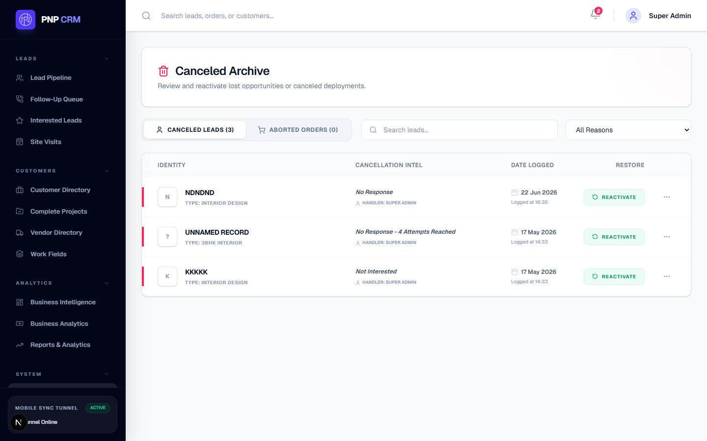
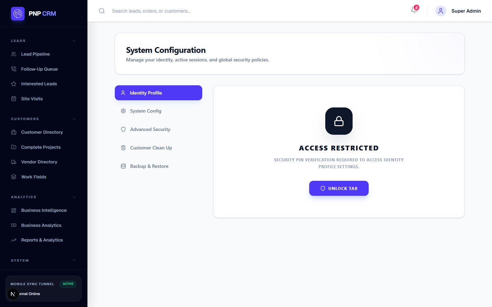
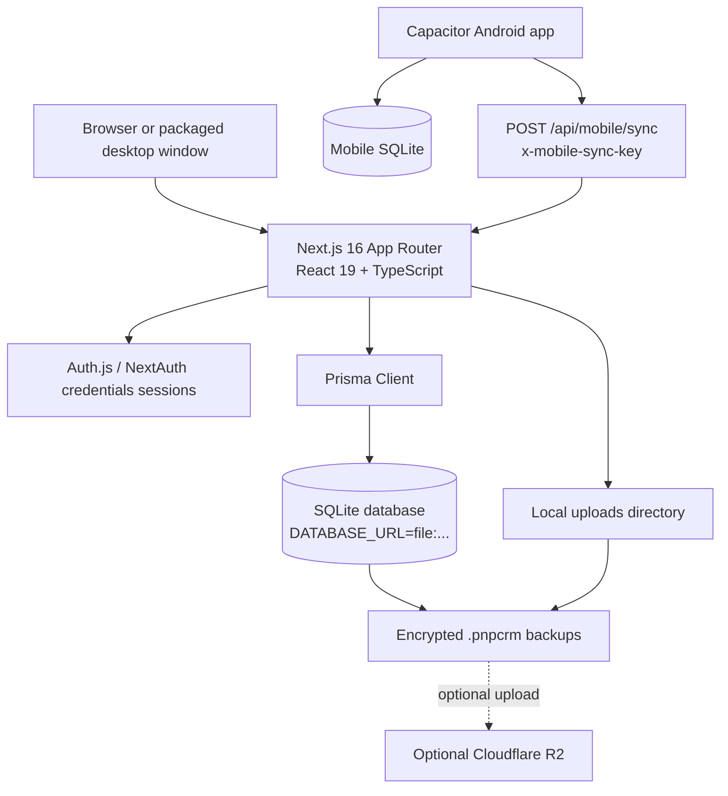

# PNP CRM

PNP CRM is a full-stack CRM and project-operations application for interior-design and construction teams. It connects lead capture, follow-ups, site visits, customer projects, quotations, expenses, financial records, milestones, notifications, and reporting in one local-first workspace.

The repository contains two related applications:

- **Desktop/web CRM:** Next.js App Router application with a Prisma-managed **SQLite** database.
- **Companion Android app:** Capacitor + Vite mobile client with on-device SQLite and an authenticated sync endpoint.

> **Status:** The core CRM is implemented and can be run with the existing `.env` and npm workflow. The Windows installer/distribution path is present in the repository, but its final release readiness still depends on environment-specific testing described in [Known limitations](#roadmap-and-known-limitations).

## Contents

- [Current status and scope](#current-status-and-scope)
- [How the CRM works](#how-the-crm-works)
- [Design and presentation](#design-and-presentation)
- [Feature overview](#feature-overview)
- [Screenshots and page guide](#screenshots-and-page-guide)
- [Architecture](#architecture)
- [Technology stack](#technology-stack)
- [Prerequisites](#prerequisites)
- [Developer installation](#developer-installation)
- [Windows installer installation](#windows-installer-installation)
- [First-run `/setup` wizard](#first-run-setup-wizard)
- [Daily operations](#daily-operations)
- [Backup and restore](#backup-and-restore)
- [Security and data protection](#security-and-data-protection)
- [Project structure](#project-structure)
- [API reference](#api-reference)
- [Mobile app](#mobile-app)
- [Troubleshooting](#troubleshooting)
- [Quality gates and release validation](#quality-gates-and-release-validation)
- [Roadmap and known limitations](#roadmap-and-known-limitations)
- [Contributing boundaries](#contributing-boundaries)
- [License and confidentiality](#license-and-confidentiality)

## Current status and scope

### Implemented

- Authenticated Next.js CRM UI with lead, customer, project, financial, quotation, reporting, notification, and settings areas.
- SQLite persistence through `prisma/schema.prisma` and Prisma Client.
- Light/dark/system/scheduled theme settings with persisted configuration.
- Customer Hub modules for details, design expenses, financials, progress, and quotations.
- Local encrypted backup files containing a SQLite-safe snapshot and uploads.
- Optional Cloudflare R2 upload for backup files when credentials are configured.
- Android companion app under `mobile/`, including local SQLite storage and `/api/mobile/sync`.
- Windows distribution files under `installer/`, `packaging/`, and `tools/`.

### Optional or conditional

- Cloudflare R2 backups require an R2 account, bucket, endpoint credentials, and environment/configuration values.
- Mobile remote sync requires a reachable CRM URL/tunnel and matching mobile sync secrets.
- The packaged Windows port defaults to **43100**. The existing developer launcher continues to use port **3000** unless `PORT` or another supported configuration overrides it.
- The installer can register a Windows Task Scheduler backup only when the required Windows/Node environment is available.

### Not claimed as universally production-ready

The repository includes distribution and mobile build assets, but a release should not be described as production-ready for every machine until the Inno Setup compiler, bundled `node.exe` payload, Task Scheduler registration, live R2 upload/restore, and a clean Windows installation have each been tested in the target environment.

## How the CRM works

PNP CRM follows a simple business flow:

1. A new inquiry is captured and checked for duplicates.
2. The team works the inquiry through the Lead Pipeline.
3. Follow-ups and site visits keep the next action visible.
4. A successful consultation can convert the lead into a Customer Hub project.
5. The project receives quotations, design expenses, financial entries, and execution milestones.
6. Final payment and completion move the project into the completed-project view.
7. Dashboard, reports, notifications, and backups help the team operate safely.



This is a workflow explanation, not a promise that every transition is automatic. The exact outcome depends on the action selected by the user and the route/business rules in the repository.

## Design and presentation

The interface is organized as a desktop-first operations workspace:

- **Navigation:** Sidebar modules and a topbar provide consistent movement between sales, customers, operations, reports, and settings.
- **Information hierarchy:** Dashboard KPI cards summarize work first; tables and detail panels provide the records behind each number.
- **Operational states:** Overdue, today, upcoming, archived, canceled, completed, and financial states use distinct badges and labels so the next action is visible quickly.
- **Customer context:** The Customer Hub keeps quotations, design, financials, progress, and details under one project-centered destination.
- **Protected areas:** Analytics and cleanup workflows use their existing PIN and authentication gates rather than exposing sensitive data in normal navigation.
- **Theme support:** The app includes light, dark, system, and scheduled theme settings. Screenshots in this README are repository assets and should be regenerated when the UI changes.
- **Responsive behavior:** Forms, filters, tables, cards, modals, and customer modules are implemented as responsive React/Tailwind surfaces; exact layout behavior should still be checked at the target desktop size.

The design descriptions below explain what each existing screen is for. They do not add features beyond the current repository.

## Feature overview

### Lead and sales operations

- Lead capture with duplicate checking, source, service type, address, budget, priority, and assigned staff.
- Lead Pipeline with status filters, date filters, sorting, hot-lead marking, action menus, and lead details.
- Follow-Up Queue with scheduled dates/times, outcomes, missed-call tracking, long-distance marking, and overdue/today/upcoming views.
- Interested Leads for warm opportunities and a separate passive Archived Leads view.
- Canceled Records with reactivation support.
- Site Visits/Meetings with scheduling, completion outcomes, notes, and address-based navigation.
- Conversion safeguards for naming and irreversible lead-to-customer conversion.

### Customer and project operations

- Customer Directory ordered by conversion/project context.
- Customer Hub with project name and customer identity.
- Customer Logistics/details and activity history.
- Design Expenses with project-specific cost and profit calculations.
- Financial Ledger with income, expenses, installment/final-payment handling, remaining due, and financial closure state.
- Project Progress milestones, phases, subcategories, completion checks, logs, and delay tracking.
- Completed Projects archive and project reactivation flows.
- Supplier/Vendor directory and Work Fields catalog.

### Quotations and reporting

- Project quotation creation, editing, ordering, itemized pricing, milestones, and payments.
- PDF quotation/report generation using jsPDF and AutoTable.
- Dashboard KPIs, reports, service-demand views, system-pulse charts, and business analytics.
- PIN-protected analytics and customer-cleanup areas.
- Notification center for active follow-ups, site visits, milestones, and related activity.

### Administration and operations

- Settings for identity, security, sessions, theme appearance, schedule, backups, restore, system configuration, and customer cleanup.
- Auth.js credentials sessions with role-aware access checks.
- Local launcher, hidden production start, stop support, desktop shortcut assets, and optional tunnel integration.
- Windows Program Files/ProgramData separation for immutable application files and mutable data.

## Screenshots and page guide

The following gallery uses the 17 screenshots already stored in `screenshots/`. Each entry explains the screen's purpose and where it fits in the workflow.

<details open>
<summary><strong>Authentication and daily overview</strong></summary>

### Login



The login page is the protected entry point. Auth.js credentials sessions control access to the dashboard, while password recovery follows the existing authentication routes.

### Dashboard


The dashboard is the daily starting point. KPI cards summarize pipeline, follow-ups, site visits, customers, archived records, completed projects, and canceled records, while charts provide operational context. Selecting a metric takes the user to the related module.

</details>

<details>
<summary><strong>Lead and sales operations</strong></summary>

### Lead Pipeline


The Lead Pipeline is the working list for active inquiries. Search, filters, sorting, hot-lead indicators, and row actions help staff decide what to contact next.

### Lead Details



Lead Details keeps profile information, requirements, activity, follow-ups, meetings, notes, and conversion actions together. It is the record-level workspace behind the pipeline row.

### Follow-Up Queue


The Follow-Up Queue turns planned contact into a daily task list. Overdue, today, and upcoming work can be reviewed with scheduled dates, times, outcomes, and notes.

### Interested Leads



Interested Leads separates warm opportunities from the main active queue. Its archived view is for passive leads that should not create normal active follow-up noise until reactivated.

### Site Visits


Site Visits/Meetings tracks consultation dates, times, addresses, notes, and completion outcomes. An address can be used for navigation where the environment supports it.

</details>

<details>
<summary><strong>Customers and project execution</strong></summary>

### Customer Directory


The Customer Directory lists converted customer projects and provides the entry point into project-specific work.

### Customer Workspace Hub


The Customer Hub is the project-centered navigation layer. It connects customer details, quotations, design expenses, financials, and progress without losing the customer/project context.

### Completed Projects



Completed Projects provides the historical view for delivered work. It is separate from the active customer workspace and supports the repository's completed-project lifecycle.

### Vendor Directory



The Vendor Directory stores supplier/vendor records used by the operational side of an interior project.

### Work Fields



Work Fields is the reusable catalog for service and work categories used by the CRM's forms and project operations.

</details>

<details>
<summary><strong>Analytics, administration, and alerts</strong></summary>

### Analytics PIN Entry


The analytics PIN screen is a deliberate security boundary before sensitive business analytics are shown. It is not a replacement for the authenticated session.

### Reports Analytics


Reports presents the available chart and reporting views for pipeline, service demand, system activity, and business analysis.

### Canceled Records



Canceled Records preserves closed inquiries separately from active work. Existing reactivation and deletion actions remain governed by the current route behavior.

### General Settings



Settings groups identity, sessions, theme appearance, scheduled theme behavior, security, backups, restore, system configuration, and cleanup controls.

### Notifications


Notifications surfaces active operational reminders such as follow-ups, site visits, milestones, and overdue work. Archived, canceled, or converted records are excluded where the current notification rules require it.

</details>

### Screenshot maintenance

Screenshots are documentation assets, not generated during installation. When a page changes, recapture the affected image, keep the existing filename when the page meaning is unchanged, and update the caption if its purpose changes. Do not place real customer credentials or sensitive records in new screenshots.

## Architecture



The source of truth for the desktop database is `prisma/schema.prisma`, whose datasource provider is `sqlite`. Prisma does not connect this project to PostgreSQL.

### Data locations

Developer mode normally uses the `DATABASE_URL` from `.env` (for example `file:./_data/crm.db`). Packaged mode uses the generated configuration under:

```text
C:\ProgramData\PNP CRM\
├── config\app-config.json
├── data\crm.db
├── uploads\
├── logs\
└── backups\
```

The installed application files are placed under:

```text
C:\Program Files\PNP CRM\
```

The packaged configuration defaults to port **43100** and persists the selected port in `app-config.json`. The developer workflow is not replaced or disabled.

## Technology stack

| Layer | Actual repository technology | Role |
| --- | --- | --- |
| Web framework | Next.js `16.2.4` App Router | Desktop/web application and API routes |
| UI runtime | React `19.2.4` | Client interaction and server-rendered UI |
| Language | TypeScript | Typed UI, route handlers, and shared utilities |
| Styling | Tailwind CSS `4.x` + PostCSS | Responsive design and theme tokens |
| Database | SQLite | Local relational persistence |
| ORM | Prisma `6.19.3` | Schema, client generation, and database access |
| Authentication | Auth.js/NextAuth `5.0.0-beta.31` | Credentials authentication and sessions |
| Validation | Zod | Request/form validation where used |
| Charts | Recharts | Dashboard, reports, and analytics charts |
| Interaction | dnd-kit, Framer Motion | Drag/drop and selected UI motion |
| Documents | jsPDF + jspdf-autotable | Quotation and report PDFs |
| Desktop runtime | Node.js + PowerShell | Developer and Windows launchers |
| Mobile runtime | Vite + React + Capacitor 7 | Android client |
| Mobile storage | `@capacitor-community/sqlite` | Offline mobile records |
| Optional object storage | AWS SDK S3 client against Cloudflare R2 | Off-device backup copy |

## Prerequisites

### Desktop developer workflow

- Windows PowerShell for the supplied scripts.
- Node.js/npm compatible with the current Next.js 16 project.
- A writable local directory for the SQLite file.
- Git, if cloning the repository.

### Optional mobile workflow

- Android Studio and Android SDK.
- Java/Gradle requirements expected by the Capacitor Android project.
- A reachable CRM URL for remote sync, or local/offline operation for development.

### Optional distribution workflow

- Inno Setup to compile `installer/PNP CRM.iss`.
- A tested Node.js runtime or a verified bundled `node.exe` release payload.
- Administrator rights for installation, ProgramData directories, and Task Scheduler registration.

## Developer installation

This is the existing developer path. The Windows installer is additive and does not require changing this workflow.

```powershell
git clone https://github.com/ManavSurani/PNP_crm.git
Set-Location PNP_crm
npm install
```

Create `.env` in the repository root. Keep secrets private and choose a SQLite path that exists or can be created:

```dotenv
DATABASE_URL="file:./_data/crm.db"
AUTH_SECRET="replace-with-a-long-random-secret"
NEXTAUTH_SECRET="replace-with-a-long-random-secret"
NEXTAUTH_URL="http://localhost:3000"

# Required only for mobile sync:
MOBILE_SYNC_SECRET="replace-with-a-mobile-sync-secret"

# Optional Cloudflare R2:
R2_ACCOUNT_ID="your-account-id"
R2_ACCESS_KEY_ID="your-access-key"
R2_SECRET_ACCESS_KEY="your-secret-key"
R2_BUCKET_NAME="pnp-crm-backup"
```

Initialize Prisma and the SQLite schema:

```powershell
npx prisma generate
npx prisma db push
```

The repository includes `seed.mjs`, which creates the development Super Admin account and global settings:

```powershell
node seed.mjs
```

Run the development server:

```powershell
npm run dev
```

Open [http://localhost:3000](http://localhost:3000). The existing `npm run build` command runs `prisma generate`, `prisma db push`, and a webpack production build; review that behavior before using it against a shared database.

## Windows installer installation

The distribution path is intentionally separate from the developer path:

1. Build or obtain a tested release payload in `packaging/release/`.
2. Compile `installer/PNP CRM.iss` with Inno Setup.
3. Run the generated installer as an administrator.
4. The installer places immutable application files in `C:\Program Files\PNP CRM\`.
5. It creates mutable directories in `C:\ProgramData\PNP CRM\` for configuration, SQLite data, uploads, logs, and backups.
6. `tools/pnp-crm-install-config.ps1` creates `app-config.json` with port `43100` and generates internal auth/backup secrets.
7. The installer attempts to register the daily backup task through `tools/pnp-crm-register-backup.ps1`.
8. The launcher starts the packaged production server and opens the desktop shortcut.

The installer does not replace a developer `.env`. When no packaged `app-config.json` exists, the existing environment-based behavior remains available. The final installer must still be validated on a clean Windows machine, especially the runtime payload and scheduled task.

## First-run setup wizard

The route [`/setup`](src/app/setup/page.tsx) is the distribution configuration screen. It reads [`/api/setup/status`](src/app/api/setup/status/route.ts) and saves through [`POST /api/setup`](src/app/api/setup/route.ts).

The wizard can:

- Show whether the ProgramData configuration and SQLite file exist.
- Choose a port, defaulting to `43100`.
- Optionally save Cloudflare R2 account ID, access key ID, secret access key, and bucket name.
- Create the ProgramData directory layout and generated internal secrets through the config adapter.

Setup write access is restricted: it is allowed before any user exists, or for an authenticated administrator after initialization. The rest of the dashboard remains protected by Auth.js. R2 fields are optional; leaving them empty keeps backups local.

After saving a new packaged port, restart the launcher so the server reads the persisted configuration.

## Daily operations

### Start the developer app

```powershell
npm run dev
```

The repository also includes `start-crm.ps1`, `start-crm.bat`, and `launch-pnp.vbs` for the existing local Windows workflow. `start-crm.ps1` prepares `_data\crm.db`, uses port `3000`, and starts a production server when `.next\BUILD_ID` exists; otherwise it can start development mode.

### Start the packaged app

From the installed application directory:

```powershell
powershell -ExecutionPolicy Bypass -File "C:\Program Files\PNP CRM\tools\pnp-crm-launch.ps1"
```

Use `-BackgroundOnly` for a silent start. The script reads the persisted ProgramData port and configuration.

### Stop the packaged app

```powershell
powershell -ExecutionPolicy Bypass -File "C:\Program Files\PNP CRM\tools\pnp-crm-launch.ps1" -Stop
```

This targets the configured CRM port. Do not terminate unrelated Node.js processes.

### Reset an administrator

The protected reset utility requires an explicit confirmation token and an email/password:

```powershell
node "C:\Program Files\PNP CRM\tools\pnp-crm-reset-admin.mjs" `
  --reset-admin `
  --confirm=PNP-CRM-RESET `
  --email=admin@example.com `
  --password="use-a-new-password"
```

The password must be at least eight characters. The command updates the user to `ADMIN` and invalidates that user's sessions. Keep the command and credentials private.

## Backup and restore

### Local backup behavior

`tools/pnp-crm-backup.mjs` is the packaged backup utility. It:

1. Uses SQLite `VACUUM INTO` with a busy timeout to create a consistent snapshot.
2. Adds the snapshot, `app-config.json`, and files under the uploads directory to an archive.
3. Writes an encrypted `.pnpcrm` file under `C:\ProgramData\PNP CRM\backups\`.
4. Uses AES-256-GCM with the configured backup secret.
5. Writes `last-backup.json`.

The legacy `scripts/auto-backup.mjs` and `scripts/run-auto-backup.vbs` remain in the repository for the existing developer/automation workflow. The settings UI also exposes backup and restore routes.

### Scheduled backup

`tools/pnp-crm-register-backup.ps1` registers **PNP CRM Daily Backup** with Windows Task Scheduler. Its settings allow battery execution, do not stop when power changes, and enable missed-run recovery (`StartWhenAvailable`). Registration can be skipped when Node.js is unavailable; verify the task on the target machine.

### Optional Cloudflare R2

If R2 credentials are configured in `.env` or the `/setup` wizard, the backup utility uploads `latest.pnpcrm` to the configured bucket. R2 is not required for local backups. Test credentials, permissions, region/endpoint behavior, and restore before relying on off-device recovery.

### Restore

The application exposes restore functionality through Settings and [`POST /api/settings/restore`](src/app/api/settings/restore/route.ts). Restore is destructive to the current data set: make and verify a current backup first, stop writes if possible, and follow the confirmation flow. Do not manually replace a live SQLite database while the server is running.

## Security and data protection

- SQLite remains local by default; no hosted database is required.
- Auth.js credentials sessions protect dashboard routes.
- Passwords are hashed with `bcryptjs`.
- Admin-only areas include analytics PIN and customer-cleanup controls.
- Mobile sync requires the `x-mobile-sync-key` value matching `MOBILE_SYNC_SECRET`.
- Next.js response headers include clickjacking, MIME-sniffing, referrer, permissions, and HSTS policies in `next.config.ts`.
- Packaged auth, backup, and internal secrets are generated into ProgramData configuration rather than entered manually.
- Backups are encrypted with AES-256-GCM before local storage or optional R2 upload.
- Keep `.env`, `app-config.json`, database files, `.pnpcrm` backups, R2 credentials, and mobile sync keys out of source control and support tickets.

These controls do not remove the need for Windows account security, disk encryption, least-privilege access, secure tunnel configuration, and tested recovery procedures.

## Project structure

```text
PNP_crm/
├── src/
│   ├── app/
│   │   ├── (auth)/login/             # Login and password recovery
│   │   ├── (dashboard)/              # Authenticated CRM pages
│   │   ├── api/                     # Next.js route handlers
│   │   └── setup/                   # Distribution setup wizard
│   ├── components/                  # Layout, analytics, quotation, and UI components
│   ├── hooks/                      # Theme, reduced-motion, count-up, and session hooks
│   └── lib/                        # Auth, Prisma, configuration, RBAC, and utilities
├── prisma/
│   ├── schema.prisma               # SQLite schema
│   └── seed.js                     # Prisma seed implementation
├── mobile/                         # Capacitor/Vite Android application
├── installer/                      # Inno Setup definition
├── packaging/                      # Release payload/build documentation
├── tools/                          # Packaged launcher, backup, setup, and reset tools
├── scripts/                        # Existing backup, icon, notifier, and setup scripts
├── screenshots/                    # Repository screenshots used above
├── public/                         # Logo, icon, and static assets
├── package.json                    # Root scripts and dependencies
├── next.config.ts                  # Security headers and Next.js configuration
└── LICENSE                         # Proprietary license
```

## API reference

All paths below are relative to the CRM origin, normally `http://localhost:3000` in developer mode or `http://localhost:43100` in packaged mode. Authentication and role requirements are enforced by individual handlers.

### Health, setup, auth, and discovery

| Methods | Route | Purpose |
| --- | --- | --- |
| `GET` | `/api/health` | Health check |
| `GET` | `/api/setup/status` | Read distribution setup status |
| `POST` | `/api/setup` | Create/update distribution configuration |
| `GET`, `POST` | `/api/auth/[...nextauth]` | Auth.js session handlers |
| `POST` | `/api/auth/reset-password` | Password reset flow |
| `GET` | `/api/search` | Global CRM search |
| `GET` | `/api/stats` | Dashboard metrics |

### Leads, follow-ups, meetings, and notifications

| Methods | Route | Purpose |
| --- | --- | --- |
| `GET`, `POST` | `/api/leads` | List and create leads |
| `GET`, `PUT`, `DELETE` | `/api/leads/[id]` | Read, update, or remove a lead |
| `GET` | `/api/leads/check-duplicate` | Check duplicate lead data |
| `POST` | `/api/leads/[id]/archive` | Archive a lead |
| `POST` | `/api/leads/[id]/reactivate` | Reactivate a canceled/archived lead |
| `POST` | `/api/leads/[id]/convert` | Convert a lead to a customer |
| `PATCH` | `/api/leads/[id]/hot` | Toggle hot-lead state |
| `GET`, `POST` | `/api/follow-ups` | Follow-up queue and creation |
| `PATCH`, `DELETE` | `/api/follow-ups/[id]` | Update/delete a follow-up |
| `GET`, `POST` | `/api/meetings` | Site visits and scheduling |
| `PATCH`, `DELETE` | `/api/meetings/[id]` | Update/delete a meeting |
| `POST` | `/api/meetings/[id]/complete` | Complete a site visit |
| `GET` | `/api/notifications` | Notification center data |
| `GET` | `/api/canceled` | Canceled Records |
| `DELETE` | `/api/canceled` | Permanently remove a canceled record |

### Customers, projects, quotations, and finance

| Methods | Route | Purpose |
| --- | --- | --- |
| `GET` | `/api/customers` | Customer directory |
| `GET` | `/api/customers/completed` | Completed projects |
| `GET` | `/api/projects` | Project data |
| `POST` | `/api/projects/[id]/complete` | Complete a project |
| `GET`, `POST` | `/api/projects/[id]/logs` | Project execution logs |
| `POST` | `/api/projects/[id]/milestones` | Add a project milestone |
| `GET`, `POST` | `/api/milestones` | Milestone data |
| `PATCH`, `DELETE` | `/api/milestones/[id]` | Update/delete a milestone |
| `PATCH` | `/api/milestones/[id]/complete` | Complete a milestone |
| `GET`, `POST`, `PATCH` | `/api/project-quotations` | Project quotations |
| `GET`, `PATCH`, `DELETE` | `/api/project-quotations/[id]` | One project quotation |
| `GET`, `POST` | `/api/project-quotations/[id]/payments` | Quotation payments |
| `GET` | `/api/project-quotations/overview` | Quotation overview |
| `GET`, `POST`, `PUT`, `DELETE` | `/api/transactions` | Financial transactions |
| `PUT`, `DELETE` | `/api/transactions/[id]` | One transaction |
| `GET` | `/api/financials` | Financial summary |
| `GET` | `/api/reports` | Report data |
| `GET` | `/api/reports/export` | Report export |

### Notes, requirements, vendors, and fields

| Methods | Route | Purpose |
| --- | --- | --- |
| `GET`, `POST` | `/api/notes` | Lead/customer notes |
| `PATCH`, `DELETE` | `/api/notes/[id]` | One note |
| `GET`, `POST` | `/api/fields` | Work Fields catalog |
| `PATCH`, `DELETE` | `/api/fields/[id]` | One work field |
| `GET`, `POST` | `/api/vendors` | Vendor data |
| `PATCH`, `DELETE` | `/api/vendors/[id]` | One vendor |
| `GET`, `POST` | `/api/suppliers` | Supplier data |
| `POST`, `GET` | `/api/leads/[id]/requirement` | Lead requirements |
| `GET` | `/api/leads/[id]/financial-logs` | Lead financial logs |

### Settings, backup, mobile, and tunnel

| Methods | Route | Purpose |
| --- | --- | --- |
| `GET`, `PATCH` | `/api/settings` | System settings |
| `GET`, `POST`, `DELETE` | `/api/settings/schedule` | Backup schedule |
| `GET` | `/api/settings/backup` | Create/download backup behavior |
| `POST` | `/api/settings/restore` | Restore a backup |
| `GET` | `/api/settings/backup-cloud` | Cloud backup status |
| `GET`, `DELETE` | `/api/settings/sessions` | Active sessions |
| `POST` | `/api/analytics/verify-pin` | Verify analytics PIN |
| `GET` | `/api/analytics` | Analytics data |
| `POST` | `/api/mobile/sync` | Authenticated mobile payload sync |
| `GET` | `/api/mobile/sync` | Mobile sync status/handshake |
| `GET`, `POST` | `/api/system/tunnel` | Tunnel status/reconnect behavior |

Route handlers can add authentication, validation, or business-rule checks beyond the method/route summary above. Treat the source files under `src/app/api/` as authoritative.

## Mobile app

The mobile client is in `mobile/` and uses Vite, React, Capacitor 7, and `@capacitor-community/sqlite`.

```powershell
Set-Location mobile
npm install
npm run build
npx cap sync android
npx cap open android
```

The Android project can be built from Android Studio. The repository also contains APK artifacts, but a new build should be produced and tested for the target device.

For sync, configure the same secret on both sides:

```dotenv
# mobile/.env
NEXT_PUBLIC_MOBILE_SYNC_SECRET="same-secret-as-the-server"

# CRM .env
MOBILE_SYNC_SECRET="same-secret-as-the-mobile-app"
```

The mobile app queues local work in SQLite when offline and sends it to `/api/mobile/sync` when connectivity returns. Remote use also requires a reachable CRM URL/tunnel; a local desktop CRM does not automatically become internet-accessible.

## Troubleshooting

### The app cannot find the database

Check `DATABASE_URL`, confirm the parent directory is writable, then run:

```powershell
npx prisma generate
npx prisma db push
```

Do not point two unrelated environments at the same live SQLite file while writes are occurring.

### Port 3000 or 43100 is already in use

Stop the matching CRM process with the supplied launcher or select a different valid port in `/setup`. Do not kill unrelated Node.js services. Packaged mode reads its persisted port from `C:\ProgramData\PNP CRM\config\app-config.json`.

### Auth.js reports an invalid/decryption session

Ensure `AUTH_SECRET` and `NEXTAUTH_SECRET` are stable and consistent for the environment. Sign out and sign in again after changing secrets; old cookies cannot be decrypted with a different secret.

### `/setup` is forbidden

After the first user exists, setup writes require an authenticated `ADMIN` session. The initial setup exception is intentionally closed after initialization.

### Backups do not upload to R2

Local backup creation does not require R2. Verify the account ID, access key, secret key, bucket name, permissions, and endpoint configuration. Test a local `.pnpcrm` file before diagnosing cloud upload.

### The Windows scheduled task is missing

Run `tools/pnp-crm-register-backup.ps1` as an administrator and confirm that `node.exe` is discoverable. The script intentionally skips registration when Node.js is unavailable.

### The mobile app does not sync

Check that the server is running, the mobile URL/tunnel is reachable, `MOBILE_SYNC_SECRET` matches the mobile environment value, and the endpoint is not being blocked by a tunnel or firewall.

## Quality gates and release validation

Before sharing a developer build:

```powershell
npx tsc --noEmit
npm run lint
npm run build
```

`npm run build` currently includes Prisma generation, `prisma db push`, and `next build --webpack`; run it only with an intentional database target. Verify the result with `npm start` and [http://localhost:3000/api/health](http://localhost:3000/api/health).

Before a Windows release, additionally verify:

1. Inno Setup compiles `installer/PNP CRM.iss`.
2. The release payload contains the required Next.js output, Prisma Windows query engine, static assets, and a tested Node.js runtime.
3. A clean machine installs into Program Files and creates ProgramData directories.
4. `/setup` creates configuration and generated secrets.
5. The desktop shortcut starts and stops only the CRM service.
6. Port 43100 (or a saved custom port) is reachable locally.
7. The scheduled task is registered and survives battery/sleep scenarios.
8. SQLite `VACUUM INTO` backup and restore work with representative uploads.
9. Optional R2 upload and restore work with real credentials.
10. Mobile sync works through the intended local/tunnel network.

## Roadmap and known limitations

- Finish repeatable clean-Windows installer testing and document the supported Node.js/runtime payload.
- Verify Inno Setup compiler output and release artifact checksums.
- Test Task Scheduler registration under the intended Windows account and sleep/wake policies.
- Test encrypted backup restore, uploads, and optional R2 against a real isolated bucket.
- Test the mobile app on supported Android versions and network conditions.
- Continue improving operational observability for packaged logs and recovery.
- Consider formal release automation after the packaging path is validated.

These are release-validation items, not claims that the current repository lacks the corresponding source files.

## Contributing boundaries

This is a private CRM with business-specific workflows. Before changing code:

- Preserve the SQLite/Prisma data model and existing `.env`/npm developer workflow.
- Do not silently migrate the project to PostgreSQL or another hosted database.
- Keep installer/distribution changes isolated to `installer/`, `packaging/`, `tools/`, and explicitly related configuration.
- Keep mobile-only changes under `mobile/`.
- Do not commit secrets, customer data, SQLite databases, backup archives, or generated credentials.
- Run the relevant type, lint, build, and environment checks before proposing a release.

## License and confidentiality

This repository is proprietary software. The root [`LICENSE`](LICENSE) reserves all rights to PNP CRM. Do not copy, modify, publish, distribute, sublicense, sell, or disclose the source code or business data without written permission from the owner.

Customer records, credentials, `.env` files, ProgramData configuration, R2 keys, mobile sync keys, and backup files are confidential and must be handled as private operational data.
